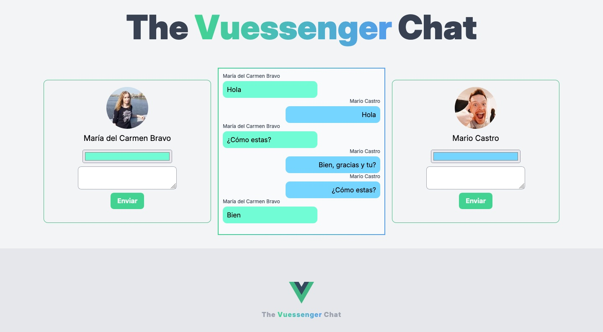

# Vuessenger

### Revisar la 👉👉 [Aplicación web](https://vuessenger.vercel.app/)

# Resumen de Elementos de Vue.js Utilizados

En este proyecto hemos implementado diversos elementos fundamentales de Vue.js para construir una aplicación de chat interactiva y dinámica. A continuación, se detallan los principales conceptos y funcionalidades de Vue.js que se han utilizado:

## 1. Componentes

Los componentes son bloques de construcción en Vue.js que permiten dividir la interfaz en unidades reutilizables e independientes, cada una con su lógica y estilos propios. En esta aplicación, hemos creado componentes como `Chat`, `MessageInput`, y `ChatContainer` (o `ChatApp`), para organizar la estructura del chat. Cada componente maneja su propia funcionalidad específica, como mostrar mensajes o capturar la entrada de usuario.

## 2. Propiedades (props)

Vue utiliza props para pasar datos de un componente padre a sus componentes hijos de forma reactiva. Por ejemplo, hemos usado props para pasar la información del usuario y los mensajes desde el componente contenedor principal (`ChatContainer.vue`) hacia los componentes `Chat` y `MessageInput`, permitiendo que cada componente hijo acceda a la información sin necesidad de duplicar datos.

## 3. Datos Reactivos (data)

La reactividad en Vue.js permite que los cambios en los datos actualicen automáticamente la interfaz de usuario. En el componente principal, se definieron propiedades como `usuarios` y `mensajes` dentro de la opción `data()`. La aplicación mantiene la lista de usuarios y mensajes de forma reactiva, actualizándose en el DOM automáticamente cuando se modifican.

## 4. Ciclo de Vida (mounted)

Vue.js ofrece métodos de ciclo de vida que permiten ejecutar código en etapas específicas del ciclo de vida de un componente. Usamos el hook `mounted` para hacer una solicitud a la API de Random User y cargar los datos de usuario cuando el componente está listo en el DOM. Este método asegura que la información esté disponible al renderizar el componente.

## 5. Métodos (methods)

Los métodos de Vue.js se utilizan para definir funciones en el componente que pueden ser invocadas dentro del template o desde otros métodos. Se definieron métodos como `obtenerUsuarios()` para realizar la llamada a la API y `agregarMensaje()` para gestionar el envío de mensajes en el chat. Los métodos permiten mantener la lógica encapsulada y reutilizable en cada componente.

## 6. Propiedades Computadas (computed)

Las propiedades computadas permiten realizar cálculos basados en datos reactivos, con la ventaja de que se almacenan en caché y se actualizan solo cuando cambian los datos dependientes. Usamos `computed` para simplificar el acceso a la información de los usuarios, creando `informacionUsuarios`, una propiedad computada que transforma y organiza los datos obtenidos de la API para facilitar su uso en el template. Esta práctica mejora la legibilidad y rendimiento del código al evitar cálculos redundantes.

## 7. Data Binding en Estilos y Clases (v-bind:style y v-bind:class)

Vue permite aplicar clases y estilos en línea de forma dinámica mediante data binding, con lo que los elementos pueden reaccionar a los datos en tiempo real. Para esta aplicación, utilizamos `v-bind:style` para definir estilos de alineación en los mensajes, permitiendo que los mensajes de cada usuario se muestren a la izquierda o derecha según corresponda. Este enfoque elimina la necesidad de múltiples clases CSS y permite un control más preciso y eficiente sobre los estilos.

## 8. Control de Flujo (v-if, v-for)

Vue utiliza directivas como `v-if` y `v-for` para el control de flujo en el template. En el proyecto, `v-if` se emplea para mostrar la información del usuario solo cuando está cargada y `v-for` para iterar sobre los mensajes de chat, creando un elemento por cada mensaje. Estas directivas permiten controlar la visibilidad y repetición de elementos en el DOM de forma declarativa.

## 9. Manejo de Eventos (@click, $emit)

En Vue.js, los eventos se manejan mediante directivas de eventos como `@click` y el sistema de emisión de eventos (`$emit`). En `MessageInput`, se capturó el evento de clic en el botón de enviar y se usó `$emit` para enviar el mensaje al componente padre, permitiendo una comunicación clara entre componentes y manteniendo la lógica de los mensajes en el contenedor principal.

## 10. Integración con API usando Axios

Utilizamos Axios, una biblioteca de JavaScript para realizar solicitudes HTTP, para consumir la API de Random User. La integración de Axios en el método `obtenerUsuarios` permite que la aplicación obtenga datos externos al montar el componente, proporcionando información dinámica y mejorando la experiencia del usuario.

## Vídeo de demostrarción

